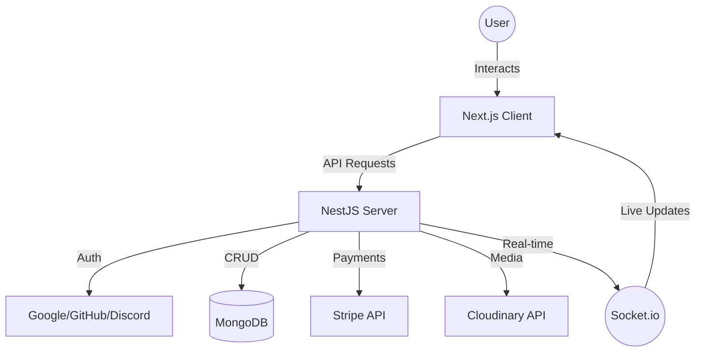

# 🛍️ Shopco - Premium E-commerce Platform


A premium, full-stack e-commerce solution designed for high performance, scalability, and a seamless shopping experience. Features real-time updates, secure payments, and a robust admin dashboard.

## 🌟 Key Features

- ✨ **Advanced Loyalty System**: Earn points on every purchase and redeem them for future orders. Includes a tiered earning system based on order value.
- 💳 **Dual Payment Methods**: Unique flexibility to pay using traditional Credit/Debit cards (Stripe) or exclusively via Loyalty Points. Hybrid payment support for split-tender transactions.
- 🚀 **Real-Time Updates**: Powered by Socket.io for instant notifications, order status changes, and inventory sync.
- 🔐 **Multi-Provider OAuth**: Secure, frictionless authentication via Google, GitHub, and Discord using Passport.js.
- 📊 **Admin Power-User Dashboard**: Comprehensive management system for handling high-volume orders, product catalogs, and user analytics.
- 🖼️ **Cloudinary Media**: High-performance image management with automatic optimization and CDN delivery.
- 📱 **Mobile-First Design**: A stunning, responsive interface built with Tailwind CSS v4 and Framer Motion for smooth animations.
- 📦 **Automated Ledger**: Integrated loyalty ledger to track every point earned, spent, or refunded.

## 🛠️ Tech Stack

### Frontend
- **Framework**: Next.js 16 (App Router)
- **State Management**: Redux Toolkit & Zustand
- **Styling**: Tailwind CSS v4 & Framer Motion
- **UI Components**: Radix UI
- **Real-time**: Socket.io-client
- **Payments**: Stripe React SDK
- **Icons**: Lucide React & React Icons

### Backend
- **Framework**: NestJS 11
- **Database**: MongoDB with Mongoose ODM
- **Auth**: Passport.js (JWT & OAuth2)
- **Real-time**: Socket.io
- **Storage**: Cloudinary
- **Payments**: Stripe Node SDK
- **API Documentation**: Swagger UI

## 🔄 Project Flow



## 📂 Project Structure

```text
🏗️ Root
├── client/                 # Next.js Frontend App
│   ├── src/
│   │   ├── app/           # App Router (Pages & Layouts)
│   │   ├── components/    # Reusable UI Components
│   │   ├── store/         # Redux & Zustand States
│   │   ├── hooks/         # Custom React Hooks
│   │   └── lib/           # Utility functions & Proxy
└── server/                 # NestJS Backend Service
    ├── src/
    │   ├── modules/       # Core Business Logic
    │   │   ├── auth/      # Authentication & OAuth
    │   │   ├── products/  # Product Management
    │   │   ├── orders/    # Order Processing
    │   │   ├── payments/  # Stripe Integration
    │   │   └── cart/      # Shopping Cart Logic
    │   ├── config/        # Environment Validations
    │   └── main.ts        # Entry Point
```

## 🚀 Getting Started

### Prerequisites
- Node.js (v18 or later)
- npm or pnpm
- MongoDB instance (Local or Atlas)
- Cloudinary Account
- Stripe Account

### 1. Installation
Clone the repository:
```bash
git clone https://github.com/maaliksaad/Shopco.git
cd Shopco
```

### 2. Backend Setup
```bash
cd server
npm install
```
Create a `.env` file in the `server` directory:
```env
PORT=4000
MONGO_URI=your_mongodb_uri
JWT_SECRET=your_jwt_secret
CLOUDINARY_CLOUD_NAME=your_cloudinary_name
CLOUDINARY_API_KEY=your_cloudinary_key
CLOUDINARY_API_SECRET=your_cloudinary_secret
STRIPE_SECRET_KEY=your_stripe_secret_key
STRIPE_WEBHOOK_SECRET=your_stripe_webhook_secret
GOOGLE_CLIENT_ID=your_google_client_id
GOOGLE_CLIENT_SECRET=your_google_client_secret
GITHUB_CLIENT_ID=your_github_client_id
GITHUB_CLIENT_SECRET=your_github_secret
DISCORD_CLIENT_ID=your_discord_client_id
DISCORD_CLIENT_SECRET=your_discord_secret
```
Start the backend:
```bash
npm run start:dev
```

### 3. Frontend Setup
```bash
cd ../client
npm install
```
Create a `.env.local` file in the `client` directory:
```env
NEXT_PUBLIC_API_URL=http://localhost:4000/api
NEXT_PUBLIC_SOCKET_URL=http://localhost:4000
NEXT_PUBLIC_STRIPE_PUBLISHABLE_KEY=your_stripe_publishable_key
```
Start the frontend:
```bash
npm run dev
```

## 🛡️ License
This project is licensed under the UNLICENSED License - see the `package.json` for details.

Created with ❤️ by Saad
